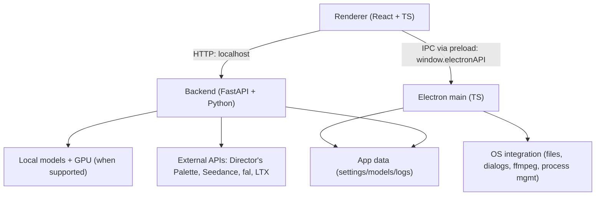

<h1 align="center">Director's Desktop</h1>

<p align="center"><strong>The AI-native video editor.<br>Generate the exact clip you need — right where you need it on the timeline.</strong></p>

<p align="center">
  <a href="https://directorspal.com"></a>
  
  
  
</p>

<p align="center">
  Director's Desktop is the desktop companion to <a href="https://directorspal.com"><strong>Director's Palette</strong></a> —
  bring your saved characters, references, and prompts straight into a timeline editor and generate AI video clips
  <em>in place</em>, without ever leaving the edit.
</p>

<p align="center">
  
</p>
<p align="center">
  
</p>
<p align="center">
  
</p>

> **Status: Beta.** Expect breaking changes. Frontend architecture is under active refactor; large UI PRs may be declined for now (see [`CONTRIBUTING.md`](docs/CONTRIBUTING.md)).

---

## Why Director's Desktop

The usual AI-video workflow is broken: generate a clip somewhere else → download it → hunt for the file → drag it into an editor → realize it's the wrong length → start over. You lose the prompt, the character references, and your place in the edit every single time.

**Director's Desktop collapses that whole loop into one move:**

> ### Select a moment on the timeline → describe the shot → the generated clip lands exactly there.

It's not "another prompt website." It's an editor that understands the **timeline**, the **transcript**, the **audio**, your **characters from Director's Palette**, the **prompt**, the **duration you need**, and the **shots before and after**. That context is what turns it from a toy into a real AI filmmaking tool — the foundation for fast music videos, YouTube videos, narrative shorts, trailers, and pitch videos.

## The core loop

1. **Load a project** — video or audio, with a transcript.
2. **Highlight a lyric or a sentence** in the transcript (or drag a range on the timeline). Director's Desktop reads the exact duration you need — select **1:08–1:11** and it knows you need a **3-second clip**.
3. **Type `@` to pull in a saved [Director's Palette](https://directorspal.com) character** — its reference sheet attaches automatically — then write your prompt.
4. **Generate.** A **placeholder** drops onto the timeline at that exact spot while it renders, tagged with the prompt, duration, and characters used.
5. **The finished clip swaps into place automatically** — and the full metadata (prompt, characters, transcript range, timeline position, duration, model) is saved with it.

> **Music video, in one line:** highlight a 3-second lyric, then prompt
> `@Truthful riding a four-wheeler through a muddy forest at night, cinematic music-video style, dramatic headlights, slow-motion mud splashing`
> → a 3-second clip lands right on the beat.
>
> **YouTube / narration:** highlight a sentence that runs 5 seconds, prompt a visual metaphor, and a 5-second clip drops straight into the timeline. Same workflow for explainers, commentary, news, trailers, and pitch decks.

## Powered by Director's Palette

[**Director's Palette**](https://directorspal.com) is the cloud brain behind Director's Desktop. Connect your account and:

- 🎭 **Your characters, styles, and references sync down** — the `@` mention system in the editor pulls the same saved characters you use on the web, so a character stays consistent across every shot.
- 🖼️ **Image & shot generation runs on your DP account and credits** — no juggling separate keys for every provider.
- 🗂️ **One gallery across web and desktop** — generate anywhere, see it everywhere.
- 💳 **Live credit balance and per-generation cost** are shown right in the header and on the Generate button, so there are no surprises.

> **New here?** Director's Desktop is most powerful with a Director's Palette account. **[Create one free at directorspal.com →](https://directorspal.com)**

## Features

### Generation
- **Text-to-video**, **image-to-video**, and **audio-to-video**
- **Seedance** cinematic video — Seedance 1.5 (first **and** last frame) and Seedance 2.0 (reference-to-video with character + audio references)
- **Image generation & editing** — via Director's Palette's shot generator, or local/fal
- **Video Retake** (regenerate a portion), **Video Extend** (continue from the last frame), **IC-LoRA** (identity-consistent generation)
- **Story / Music / Plain prompt modes** — Music mode turns pasted lyrics into shot prompts; Story mode keeps a narrative consistent across moments
- **AI prompt enhancement** — via Director's Palette, LTX, OpenRouter, or Gemini

### Timeline & transcript
- **Multi-track timeline editor** with clips, transitions, and keyframes
- **Word-level transcript panel** — click a word to jump the playhead; highlight a range to set the clip duration
- **Generate-into-the-timeline** — placeholders hold the spot while a clip renders, then swap in automatically

### Batch generation
- **Batch Builder** — queue many jobs at once
- **List / Import / Grid-Sweep** modes — add prompts one by one, bulk-import from CSV/JSON/text, or run combinatorial sweeps (prompts × seeds × models)
- **Timeline import** — re-generate every segment of an edited timeline as a batch

### Library & organization
- **Gallery**, **Prompt Library**, **Characters**, **Styles**, **References**, and **Wildcards** — all syncable with Director's Palette

### Export
- **FFmpeg export** with configurable codec and quality
- **Video Projects** — save and reopen editing sessions

## Local vs. API mode

| Platform / hardware | Generation mode | Notes |
| --- | --- | --- |
| Windows + CUDA GPU with **≥32 GB VRAM** | Local generation | Downloads model weights locally |
| Windows (no CUDA, <32 GB VRAM, or unknown) | API-only | API key or Director's Palette account required |
| macOS (Apple Silicon) | API-only | API key or Director's Palette account required |
| Linux | Not officially supported | No official builds |

In API-only mode, the cloud providers (Director's Palette, Seedance, fal, LTX) do all the heavy lifting — you don't need a local GPU at all.

## Custom video models

Director's Desktop supports multiple LTX 2.3 model formats so you can run on GPUs with less VRAM.

| Your GPU VRAM | Recommended format | File size |
|---|---|---|
| 32 GB+ | BF16 (auto-downloaded) | ~43 GB |
| 20–31 GB | [FP8 Checkpoint](https://huggingface.co/Lightricks/LTX-Video-2.3-22b-distilled) | ~22 GB |
| 16–19 GB | [GGUF Q5_K](https://huggingface.co/city96/LTX-Video-2.3-22b-0.9.7-dev-gguf) | ~15 GB |
| 10–15 GB | [GGUF Q4_K](https://huggingface.co/city96/LTX-Video-2.3-22b-0.9.7-dev-gguf) | ~12 GB |

**Setup:** download the model for your GPU → **Settings → Models**, set your model folder → for GGUF/NF4 also grab the [distilled LoRA](https://huggingface.co/Lightricks/LTX-Video-2.3-22b-distilled) → pick your model → generate. The built-in **Model Guide** (Settings → Models → Open Model Guide) detects your GPU and recommends a format automatically.

## System requirements

**Windows (local generation):** Windows 10/11 (x64) · NVIDIA CUDA GPU with **≥32 GB VRAM** · 16 GB+ RAM (32 GB recommended) · ample free disk for weights and outputs.

**macOS (API-only):** Apple Silicon (arm64) · macOS 13+ (Ventura) · stable internet.

## Install

1. Download the latest installer from [**Releases**](../../releases).
2. Install and launch **Director's Desktop**.
3. Complete first-run setup, then connect your [Director's Palette](https://directorspal.com) account in **Settings → Palette Connection**.

### First run & data locations

App data (settings, models, logs) is stored in:

- **Windows:** `%LOCALAPPDATA%\LTXDesktop\`
- **macOS:** `~/Library/Application Support/LTXDesktop/`

Model weights download into the `models/` subfolder (large; may take time). On first launch you may be prompted to review model license terms (fetched from Hugging Face; requires internet).

**Text encoding** is required to generate video, via either:
- **A Director's Palette / LTX API key** (cloud) — **text encoding is completely FREE** and recommended to speed up inference and save memory. Free key at the [LTX Console](https://console.ltx.video/).
- **Local Text Encoder** (extra download) — fully-local operation on supported Windows hardware.

## API keys, cost & privacy

Your keys are stored locally in your app-data folder — treat them like secrets. They are never committed to this repo.

- **Director's Palette account** *(recommended)* — syncs characters/styles/references, runs image & shot generation on your DP credits, and tracks balance + cost in the UI. **Local GPU generations are free.** [directorspal.com](https://directorspal.com)
- **LTX API key** — FREE cloud text encoding + prompt enhancement; paid for API video generation and Retake. [LTX Console](https://console.ltx.video/)
- **Replicate** *(optional)* — Seedance 1.5 video. [Replicate dashboard](https://replicate.com/account/api-tokens)
- **fal** *(optional)* — Seedance 2.0 video and Z-Image image generation. [fal dashboard](https://fal.ai/dashboard/keys)
- **OpenRouter / Gemini** *(optional)* — AI prompt suggestions.

When you use API-backed features, prompts and media inputs are sent to that service. Credits are consumed only for API-backed generations; local GPU generations are free.

## Architecture

Three layers:

- **Renderer (`frontend/`)** — TypeScript + React UI. Calls the local backend over HTTP and talks to Electron via the `window.electronAPI` preload bridge.
- **Electron (`electron/`)** — TypeScript main + preload. Owns app lifecycle and OS integration (file dialogs, ffmpeg export, managing the Python backend). The renderer is sandboxed (`contextIsolation: true`, `nodeIntegration: false`).
- **Backend (`backend/`)** — Python + FastAPI local server. Orchestrates generation, model downloads, and GPU execution; calls external APIs only for API-backed features.



See [`backend/architecture.md`](backend/architecture.md) and [`CLAUDE.md`](CLAUDE.md) for the full map.

## Development

**Prereqs:** Node.js · [`pnpm`](https://pnpm.io) · `uv` (Python package manager) · Python 3.12+ · Git.

```bash
pnpm install
pnpm setup:dev:win     # or :mac — one-time environment setup
pnpm dev               # Vite + Electron + Python backend
pnpm dev:debug         # + Electron inspector and Python debugpy

pnpm typecheck         # tsc (TypeScript) + pyright (Python)
pnpm backend:test      # Python pytest suite
pnpm test:frontend     # vitest pure-function suites
```

Building installers: see [`INSTALLER.md`](docs/INSTALLER.md).

## Telemetry

Minimal, anonymous usage analytics (app version, platform, a random install ID) help prioritize development. No personal information or generated content is collected. Enabled by default; disable in **Settings → General → Anonymous Analytics**. See [`TELEMETRY.md`](docs/TELEMETRY.md).

## Docs

- [`docs/HANDOFF-KENIL.md`](docs/HANDOFF-KENIL.md) — what's built vs. what's next (project orientation)
- [`INSTALLER.md`](docs/INSTALLER.md) — building installers
- [`TELEMETRY.md`](docs/TELEMETRY.md) — telemetry and privacy
- [`backend/architecture.md`](backend/architecture.md) — backend architecture

## Contributing

See [`CONTRIBUTING.md`](docs/CONTRIBUTING.md).

## License

Apache-2.0 — see [`LICENSE.txt`](LICENSE.txt). Third-party notices (including model licenses/terms): [`NOTICES.md`](NOTICES.md).

<p align="center"><sub>Built to work with <a href="https://directorspal.com">Director's Palette</a> · think, generate, edit, and assemble — without leaving the timeline.</sub></p>
